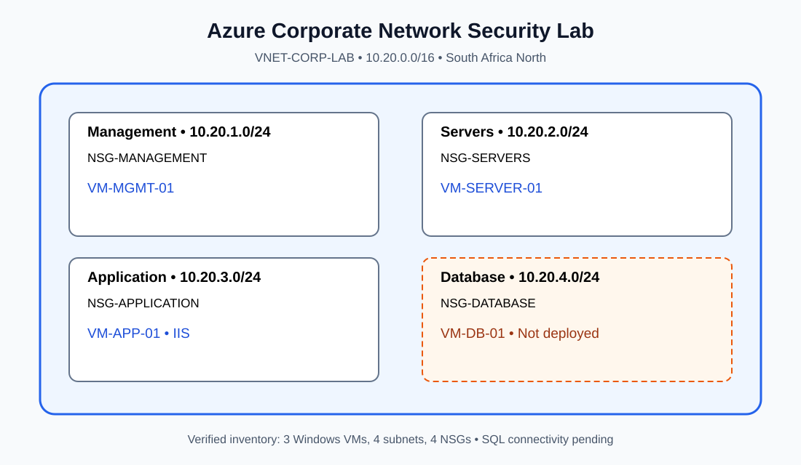

# Azure Corporate Network Infrastructure & Security Lab

**Samuel Gebu | Azure Administration & Cloud Networking Portfolio**

> **Status:** Four subnets, four NSGs and three Windows VMs deployed. IIS and internal connectivity tested. Database VM and SQL connectivity remain pending.

## Why I built this
I built this hands-on lab to understand how an organization can segment cloud networks, restrict traffic between server roles, administer Windows VMs and troubleshoot real connectivity problems.

## Network architecture

## Azure environment

| Component | Configuration |
|---|---|
| Resource group | `RG-CORP-NETWORK-LAB` |
| Region | South Africa North |
| Virtual network | `VNET-CORP-LAB` — `10.20.0.0/16` |
| Management | `SNET-MANAGEMENT` — `10.20.1.0/24` — `NSG-MANAGEMENT` |
| Servers | `SNET-SERVERS` — `10.20.2.0/24` — `NSG-SERVERS` |
| Application | `SNET-APPLICATION` — `10.20.3.0/24` — `NSG-APPLICATION` |
| Database | `SNET-DATABASE` — `10.20.4.0/24` — `NSG-DATABASE` |

## Virtual machines

| VM | Purpose | Export status |
|---|---|---|
| `VM-MGMT-01` | Administrative access | Deployed |
| `VM-SERVER-01` | Internal Windows server | Deployed |
| `VM-APP-01` | IIS web server | Deployed |
| `VM-DB-01` | Planned SQL database | **Not present in export** |

The inventory establishes deployment, not live power state.

## Network security
I configured subnet-level NSGs to restrict inbound access. Management-to-Server RDP (TCP 3389) is permitted, and the Application subnet permits HTTP/HTTPS (80/443) from the Management subnet. The Database NSG permits SQL TCP 1433 from the Application subnet, but no database endpoint was verified. Public RDP access to the Management VM is restricted to a specific administrator IP, redacted from this portfolio.

See [network architecture](docs/architecture.md), [security rule details](docs/security-rules.md), and [export findings](docs/export-findings.md).

## Tests and lessons learned
- **Management → Server, TCP 3389:** succeeded using `Test-NetConnection`.
- **Management → Application, TCP 3389:** failed as expected under the isolation policy.
- **Management → Application, HTTP 80:** succeeded; IIS welcome page loaded.
- **Application → Database, TCP 1433:** not verified.

I troubleshot RDP authentication and configuration issues, reviewed NSG rules, and learned to validate traffic with actual connection tests rather than assuming a configured rule guarantees access.

## Next steps
Deploy and configure the database VM, validate SQL connectivity, capture genuine Azure Portal screenshots with sensitive details redacted, and review security hardening options such as Azure Bastion or just-in-time VM access.

**Author:** Samuel Gebu