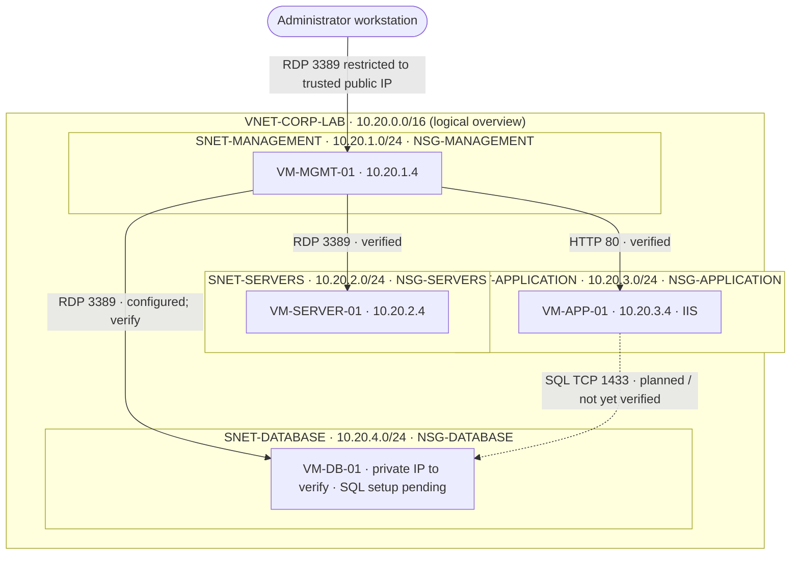

# Azure Corporate Network Architecture

> Diagram depicts logical traffic paths, not a claim that all services are running. The VNet-wide address space shown is illustrative; verify the actual VNet address space in Azure before publishing.
