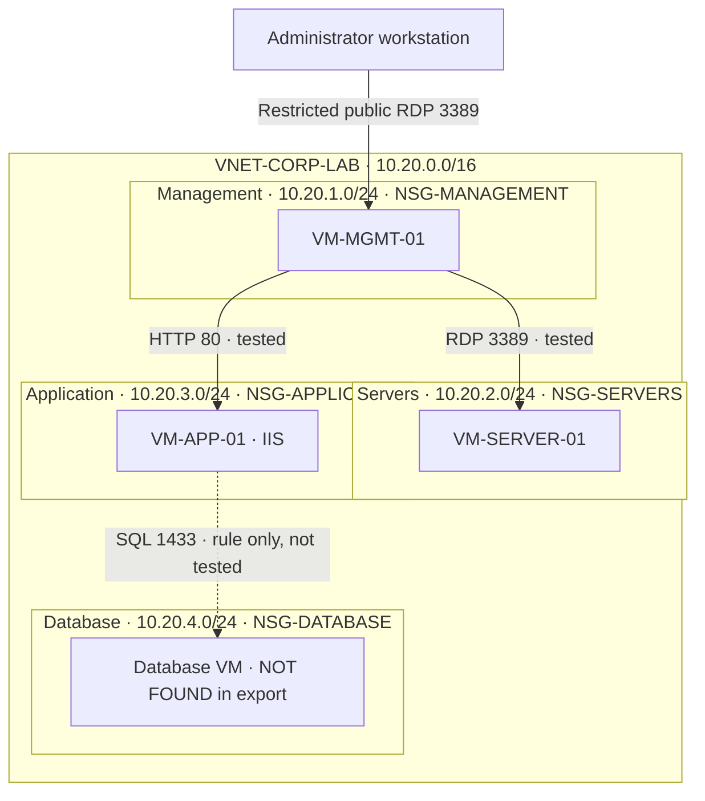

# Azure Network Architecture

Solid internal arrows indicate paths tested during the lab. The dashed SQL path indicates a configured NSG rule, not a verified database connection. The database VM is a planned component.